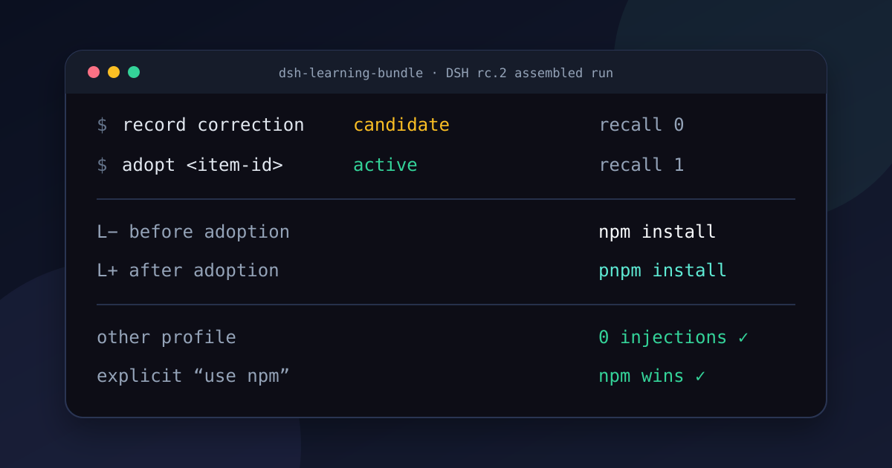

# dsh-learning-bundle

> Unofficial community bundle for [DeepSeek Harness](https://github.com/deepseek-ai/deepseek-harness).

[](https://github.com/B1lli/dsh-learning-bundle/releases/latest)
[](https://github.com/B1lli/dsh-learning-bundle/actions/workflows/ci.yml)
[](./LICENSE)

**A proof-carrying correction loop for DSH.** Record a correction as a
candidate, adopt it deliberately, recall it only in the right
profile/workspace/session, and reconstruct every model-visible delivery from
the session log.



This is a deliberately narrow Stage 0+1 release. It does not auto-generate
memories, silently activate them, or claim to be a general RAG system.

## The 60-second proof

The same headless task was run through the real plugin twice on DSH
`v0.1.1-rc.2`:

| Arm | Learned item | Model-visible injection | Final response |
|---|---|---:|---|
| L− | candidate | 0 | `npm install` |
| L+ | explicitly adopted | 1 | `pnpm install` |

The other profile received zero injections, five explicit npm/Yarn overrides
won, and the L+ delivery was reconstructed from the durable session log. Read
the [current machine-readable transcript](./benchmark/results/assembled-transcript-current.json)
or run the fast public contract yourself:

```sh
git clone --depth 1 https://github.com/B1lli/dsh-learning-bundle.git
cd dsh-learning-bundle
npm test && npm run benchmark
```

## Who it is for

This bundle is for people who repeatedly correct a coding agent and need the
correction to survive the next session without becoming an invisible global
rule: heavy DSH users, independent developers, professional engineers, and
plugin/platform authors validating agent behavior.

The pain is cumulative rather than theatrical: repeated teaching wastes turns,
an over-broad memory silently changes unrelated work, and an opaque recall makes
the next mistake hard to diagnose. For frequent agent users, that is a
high-frequency trust and productivity failure.

## Why this instead of “more memory”

Agent corrections are useful only if they are safe to reuse. A global,
invisible memory can leak one project's convention into another; an opaque
prompt injection is difficult to audit; automatic activation can turn a bad
guess into a durable rule.

This bundle uses four concrete boundaries:

- new items remain `candidate` until an explicit `adopt`;
- profile, workspace, and session scopes fail closed;
- a current explicit instruction overrides a learned default;
- recalled items are logged as `user/message` records with
  `source.kind = dsh-learning-recall`.

The checked rc.2 evidence also demonstrates an observable difference: the
same task produces `npm install` before adoption and `pnpm install` after the
adopted rule is delivered.

| Approach | What it optimizes | Where this bundle differs |
|---|---|---|
| General memory / RAG | broad storage and retrieval | explicit adoption, fail-closed scope, current-instruction override |
| `AGENTS.md` / static instructions | human-authored repository policy | a record/adopt/recall lifecycle plus per-delivery receipts |
| [dsh-mnemon](https://github.com/omdsh-dev/dsh-mnemon) | a full supervised memory control plane with Web UI and multiple providers | this bundle is dependency-free and deliberately limited to correction delivery |
| [dsh-continual-evolve](https://github.com/ZK-Andy/dsh-continual-evolve) | versioned self-evolution, approval, rollback, and benchmark acceptance | this bundle publishes a smaller candidate→adopt contract with per-delivery receipts and a same-task L−/L+ proof |
| This bundle | a narrow correction-delivery reference | profile/workspace/session fail-closed recall, causal L−/L+ proof, and log reconstruction |

The agent-memory category is not empty, and the projects above are more capable
choices for broad memory or self-evolution. This project's narrower market
hypothesis is that plugin authors and evaluation-minded users also value a small,
inspectable reference that proves a correction reached the model only where
allowed and changed the result. Adoption—not this README—must determine whether
that niche is actually under-served.

## Behavior status

| Behavior | Evidence |
|---|---|
| candidate → explicit adoption → active recall | implemented and tested |
| profile/workspace/session isolation | implemented and tested |
| current explicit instruction wins | implemented and tested |
| adjacent-negative prompts do not recall | implemented and tested |
| logged, reconstructable delivery | implemented and tested |
| real headless plugin assembly on current `dsh` rc.2 | checked transcript |
| historical rc.8 assembly and live DeepSeek 3× L− / 3× L+ sample | checked snapshots |
| Web UI, team sharing, automatic extraction, sealed holdout | not claimed |

The live sample is a bounded demonstration, not a population success rate.

## Real-world scenario evidence

The public scenario benchmark covers eight common pains: package-manager drift,
Python test entry points, formatters, monorepo builds, deployment defaults,
session-only debugging, bilingual release notes, and `.env` bootstrap. All
**72/72 deterministic product-contract probes pass** across candidate blocking,
adopted recall, paraphrases, adjacent negatives, identity isolation, current
overrides, exact delivered content, and delivery reconstruction.

This is public regression evidence, not a claim about model quality. It stays
separate from the checked 3× L− / 3× L+ live DeepSeek sample and the current rc.2
assembled consumer. See [the scenario report](./docs/SCENARIO_BENCHMARK.md) and
[machine-readable result](./benchmark/results/scenarios.json).

## Install and try it

Requirements: Node `^22.19.0 || >=24.0.0`, `pnpm` on `PATH`, and a DSH version
listed in `package.json` → `dsh.compatibility`. See the [STORE compatibility,
permissions, failure boundaries, and disposable lifecycle evidence](./docs/STORE_COMPATIBILITY.md).

For the 0.3.1 STORE metadata repair, install from a checkout of the fixed
GitHub commit using the development instructions below.

The earlier 0.3.0 release tarball remains available, but does not contain the
0.3.1 metadata repair:

```sh
curl -LO https://github.com/B1lli/dsh-learning-bundle/releases/download/v0.3.0/dsh-learning-bundle-0.3.0.tgz
dsh plugin --profile headless add -w ./dsh-learning-bundle-0.3.0.tgz
```

The package CLI is installed inside that profile. From the workspace whose
convention you want to preserve:

```sh
cd /path/to/your-project
DSH_LEARNING_BIN="${DSH_HOME:-$HOME/.dsh}/profiles/headless/node_modules/.bin/dsh-learning"

"$DSH_LEARNING_BIN" record \
  --profile headless \
  --statement "Use pnpm instead of npm for dependency installs." \
  --scope workspace --workspace-id "$(pwd -P)" \
  --keyword install,installs,installed,installing --keyword dependencies \
  --exclude "explicitly use npm" \
  --override-term npm --override-term yarn --override-term bun

"$DSH_LEARNING_BIN" adopt <item-id>
dsh --profile headless "Install the JavaScript dependencies for this workspace."
```

For development, link a checkout instead:

```sh
git clone https://github.com/B1lli/dsh-learning-bundle.git
cd dsh-learning-bundle

# Link this checkout into the headless profile and activate its bundle layer.
dsh plugin --profile headless add -w "$(pwd -P)"

# Record a correction. It is a non-recallable candidate at this point.
node scripts/learning.mjs record \
  --profile headless \
  --statement "Use pnpm instead of npm for dependency installs." \
  --scope workspace --workspace-id "$(pwd -P)" \
  --keyword install,installs,installed,installing --keyword dependencies \
  --exclude "explicitly use npm" \
  --override-term npm --override-term yarn --override-term bun

# Adopt the returned item id, then run a relevant task.
node scripts/learning.mjs adopt <item-id>
dsh --profile headless "Install the JavaScript dependencies for this workspace."
```

Each `--keyword` is one required trigger group. Comma-separated values inside
the same flag are literal alternatives: plain ASCII words use word boundaries,
while developer tokens such as `C++`, `@scope/pkg`, CLI flags, and dotfiles are
matched by their literal spelling. Each `--override-term` names a choice in the
current task that suppresses the learned default. The CLI resolves workspace
paths to their physical identity so symlink checkouts match dsh's recorded cwd.

The CLI and plugin resolve the same store in this order:
`DSH_LEARNING_STORE`, `$DSH_HOME/dsh-learning-store.json`, then
`~/.dsh/dsh-learning-store.json`.

## Core API

The Cordis plugin is the package's default export. Dependency-free learning
primitives are available through the explicit `dsh-learning-bundle/core`
subpath:

```js
import {
  createLearningStore,
  recallLearning,
  buildLearningMessage,
  reconstructLearningDelivery,
} from 'dsh-learning-bundle/core'
```

The plugin itself is read-only: it recalls adopted items during
`agent/pre-step`, but never records or adopts them.

## Verify

The fast checks do not need credentials and do not modify checked-in evidence:

```sh
npm test
npm run benchmark
npm run benchmark:scenarios
```

To rebuild the current compatibility transcript, clone and build the exact
official rc.2 commit below. `zstdcat` from the `zstd` package is required to inspect
the durable session logs.

```sh
git clone https://github.com/deepseek-ai/deepseek-harness.git
cd deepseek-harness
git checkout b150a551b8d465e31e418e1b2eaf5e79bbb7d28e
corepack pnpm@11.7.0 install --frozen-lockfile
corepack pnpm@11.7.0 run build

cd /path/to/dsh-learning-bundle
DSH_SOURCE_ROOT=/path/to/deepseek-harness \
DSH_CLI_PATH=/path/to/deepseek-harness/apps/cli/lib/bin.js \
npm run benchmark:assemble:current
npm run benchmark:refresh
```

To refresh the preregistered live semantic snapshot, supply the API key only
to the process; it is never written to results:

```sh
DEEPSEEK_API_KEY=... \
DSH_SOURCE_ROOT=/path/to/deepseek-harness \
DSH_CLI_PATH=/path/to/deepseek-harness/apps/cli/lib/bin.js \
npm run benchmark:live
npm run benchmark:refresh
```

See [BENCHMARK.md](./BENCHMARK.md) for the gates, retry policy, evidence
layers, and explicit non-claims.

## Project layout

- `src/index.js` — dependency-free learning lifecycle and recall core;
- `lib/index.js` — Cordis `agent/pre-step` consumer;
- `scripts/learning.mjs` — manual record/adopt/list CLI;
- `scripts/run-benchmark.mjs` — fast acceptance decision;
- `scripts/run-scenario-benchmark.mjs` — eight-scenario, 72-probe regression;
- `scripts/assemble-transcript.mjs` — real pinned-version headless assembly;
- `scripts/run-live-semantic.mjs` — bounded live DeepSeek semantic gate;
- `benchmark/results/` — sanitized, inspectable evidence snapshots.

## Limits and status

- Current DSH rc.2 compatibility: **PASS** on the pinned official commit.
- Deterministic public contract: **PASS**, 8 scenarios / 72 probes.
- Historical bounded live DeepSeek sample: **PASS**, 3 L− + 3 L+ decisions.
- Automatic correction extraction, team sync, UI, adoption/retention, aggregate
  canary, and sealed holdout: **UNPROVEN / not implemented**.
- This project is unofficial and does not imply DeepSeek endorsement.

## License

MIT. See [NOTICE](./NOTICE) for provenance.
